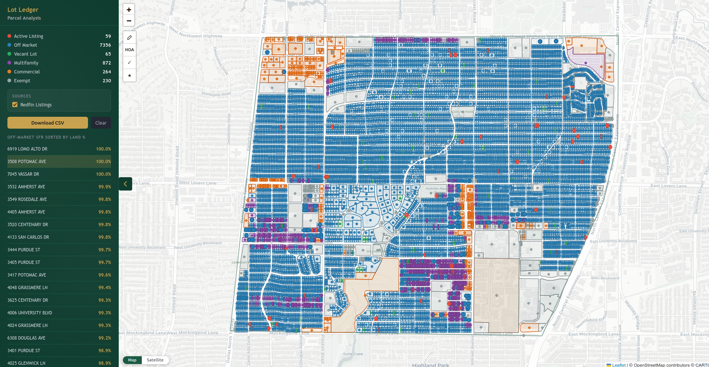
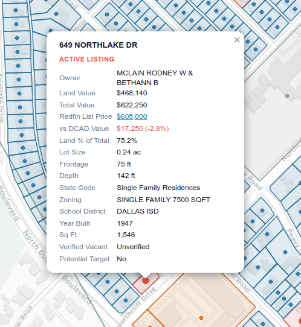
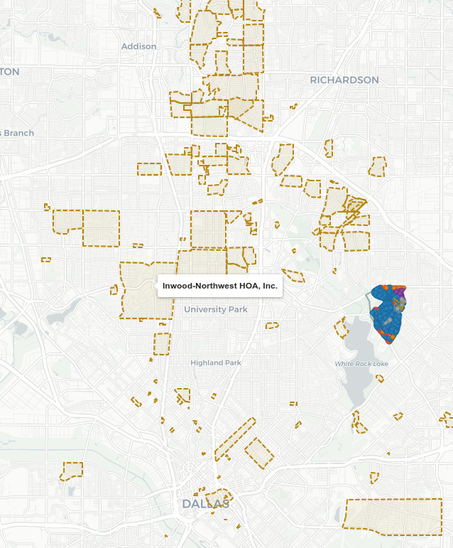
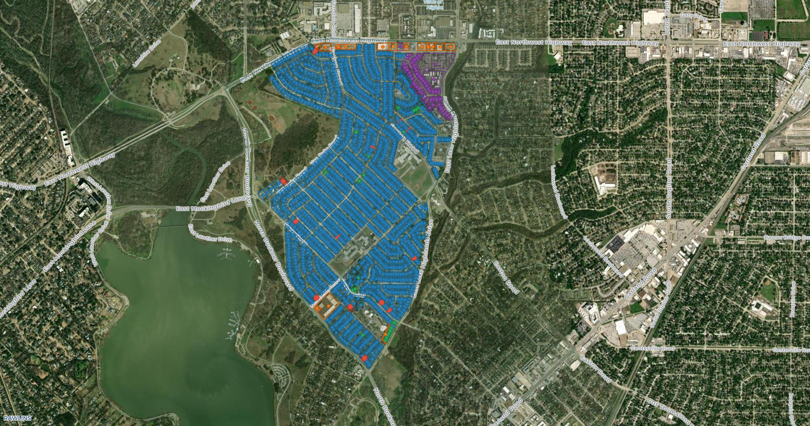
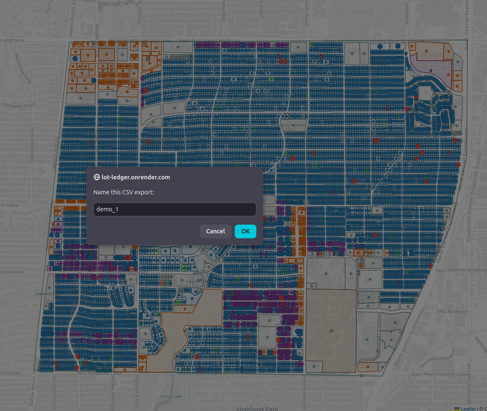
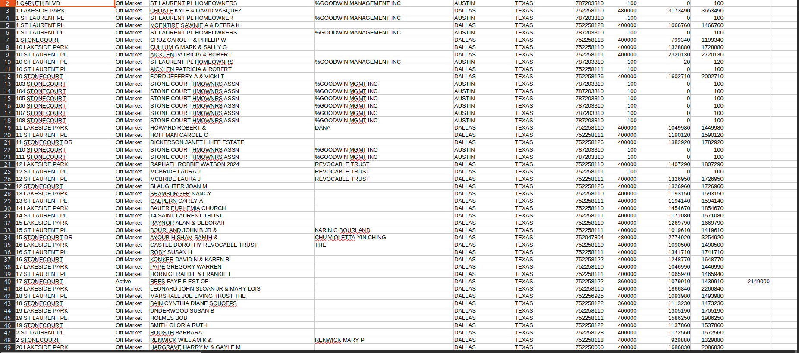

# LotLedger

LotLedger is a Dallas parcel intelligence web app for acquisition teams.

Core flow:
1. Draw a polygon on the map.
2. Review parcel classifications, active listing overlay, and HOA boundaries.
3. Tag parcels with verification and target marks.
4. Export a clean, analyst-ready CSV.

## What It Is

- Internal analyst tool for fast parcel triage.
- County-data-first platform (DCAD + TAD).
- Map + export workflow, not a consumer home search app.

## What It Is Not

- Not a CRM.
- Not a consumer listing portal.
- Not an automated valuation model.

## Live Feature Set

**Parcel analysis**
- Polygon-based analysis — draw any shape, get everything inside.
- Exact drawn-boundary filtering (ray-cast point-in-polygon, not just bbox).
- Multi-county routing by drawn area (Dallas + Tarrant supported).
- Parcel type color classification (see Color Meaning below).
- Sidebar shortlist of off-market SFR sorted by land % of total value.

**Redfin active listing overlay**
- Async grid-cell pull from Redfin covering the drawn polygon bbox.
- Active parcels highlighted red with circle centroid markers.
- Popup shows Redfin List Price (linked to listing) and delta vs DCAD appraised value.
- Delta line is color-coded green (listing above DCAD) or red (below).
- Source toggle in sidebar — uncheck Redfin Listings to hide the overlay; DCAD parcel outlines stay visible.
- Address matching uses USPS suffix canonicalization so abbreviations like `CRST`→`CREST` and `DR`→`DRIVE` resolve correctly across both sources.
- Redfin failure degrades gracefully — core DCAD analysis is unaffected.

**Overlays and basemaps**
- HOA boundaries overlay (177 Dallas HOA polygons) with name/URL tooltip.
- Street/Satellite basemap switcher (with label overlay on satellite).

**Verification and target tools**
- Verify Vacant / Verify Not Vacant — drop a badge on the parcel.
- Remove Verify — clears the badge.
- Interested / Unselect — star badge for potential targets.
- Active Tool status chip always visible in sidebar header.
- All tags persist in export.

**Export**
- On-demand CSV download from the active analysis job.
- Filename is user-editable at export time with a timestamped default.
- 32 columns including: address, MLS status, owner info, land/improvement/total value, Redfin List Price, land %, lot dimensions, year built, sq ft, zoning, school district, legal description, lat/lng, Google Maps link, Verified Vacant, Potential Target, HOA, HOA URL.

**Rendering safeguards**
- Condo parcels render as circle markers (no stacked polygon overfill).
- Redfin circle markers route to a separate layer group; polygon outlines always stay on the base layer.

## Color Meaning

- Red: active listing
- Blue: off-market single family
- Green: vacant lot
- Purple: multifamily
- Orange: commercial
- Gray: exempt

## Screenshots

### Full Workflow View

Main app view with polygon analysis, parcel color classification, and sidebar results.



### Redfin Price Comparison

Active listing popup showing the Redfin List Price and the dollar/percent delta versus DCAD appraised value.



### HOA Overlay

HOA boundary polygons displayed on the map for quick association context.



### Satellite View

Satellite basemap mode for quick roof/lot visual verification.



### Export Prompt

CSV export naming prompt shown before generating the download.



### Exported Spreadsheet

Full-screen CSV output review in spreadsheet format.



## Stack

### Backend
- Python 3.11+
- FastAPI
- asyncio
- psycopg2-binary

### Database
- Google Cloud SQL (PostgreSQL + PostGIS)
- Spatial functions: ST_Intersects, ST_Within, ST_MakeEnvelope, ST_AsGeoJSON
- GIST indexes for geometry performance

### Frontend
- Vanilla JavaScript
- Leaflet.js
- Leaflet.draw
- Custom Leaflet controls for toolbox and basemap switching
- Custom badge rendering for verification and target marks

### Hosting
- Render (service + auto deploy)

## Data Sources

- DCAD appraisal/account/land/residential/exemption exports
- DCAD parcel geometry shapefile
- TAD ParcelView shapefile (normalized to EPSG:4326 and loaded into `tad_parcels`)
- City of Dallas HOA boundaries GeoJSON
- Redfin listing grid endpoint (best-effort)

## Tarrant County Notes (TAD)

Tarrant support is now live and uses a dedicated ingest + query path separate from DCAD.

How it works:
- DCAD flow remains unchanged (`parcels` + appraisal/detail joins).
- TAD flow uses a dedicated PostGIS table (`tad_parcels`) built from ParcelView.
- `/api/analyze` routes by polygon bbox:
	- Dallas overlap -> query DCAD path.
	- Tarrant overlap -> query TAD path.
	- Boundary overlap -> query both and merge.

Classification parity with DCAD:
- TAD classification uses `property_class` (A1/C1/F1/B2/etc.), not broad `state_use_code` letters.
- Category output is normalized to the same frontend palette:
	- Blue: off-market SFR
	- Green: vacant
	- Purple: multifamily
	- Orange: commercial
	- Gray: exempt

Field parity and known differences:
- Land/Improvement/Total values come directly from `tad_parcels` financial fields.
- Lot size uses best-effort fallback: `land_sqft` -> `land_acres` -> `acres`.
- Some TAD fields are code-based in ParcelView (for example school/city code values). Those codes are currently passed through as-is.
- Frontage/depth and zoning may be blank in TAD where ParcelView does not provide direct equivalents.

Operational note:
- A small share of TAD parcels legitimately carry zero values (for example exemptions or appraisal conditions). Zero-valued parcels are not automatically a bug.

## Project Layout

- `api/main.py` — FastAPI routes: `/api/analyze`, `/api/download/:id`, `/api/job/:id/verification`, `/api/hoa`, `/health`, `/health/db`
- `api/dcad.py` — parcel bbox query, exact polygon filter, multi-table join (appraisal/res/land), classification logic, GeoJSON feature builder
- `api/redfin.py` — async Redfin grid pull, USPS address normalization, listing metadata dict
- `api/geo.py` — `polygon_bbox()` and ray-cast `point_in_polygon()`
- `api/config.py` — environment validation and psycopg2 connection pool
- `scripts/build_db.py` — DCAD CSV→Postgres loader (upsert-safe)
- `scripts/load_hoa.py` — HOA boundary shapefile→PostGIS loader
- `scripts/validate_tad_extract.py` — validates TAD folder completeness and projection status
- `scripts/reproject_tad_parcelview.py` — reprojects TAD ParcelView to EPSG:4326 output files
- `scripts/build_tad_db.py` — TAD ParcelView→Postgres loader (dry-run default, write mode + checkpoint resume)
- `frontend/index.html` — app shell (Leaflet 1.9.4 + Leaflet.draw 1.0.4 from CDN)
- `frontend/map.js` — all client logic: map init, draw handler, feature renderer, verification/target brushes, popup builder, export trigger
- `frontend/style.css` — dark-panel sidebar, map toolbar, popup/badge styles
- `docs/BRIEFING.md` — owner-facing current-state briefing
- `docs/ROADMAP.md` — prioritized backlog

## Local Setup

1. Create and activate virtual environment.
2. Install dependencies.

```bash
pip install -r requirements.txt
```

3. Create environment file.

```bash
cp .env.example .env
```

4. Fill required env vars:
- DB_HOST
- DB_PORT
- DB_NAME
- DB_USER
- DB_PASSWORD
- PORT

5. Start API.

```bash
uvicorn api.main:app --reload
```

6. Open:
- http://localhost:8000

## Build or Refresh DCAD Database

```bash
python -m scripts.build_db
```

The loader uses upserts so reruns update existing records.

## Build TAD Module (Tarrant)

Unlike DCAD (single command), TAD uses a multi-step module flow:

1. Validate extracted TAD files.
2. Reproject ParcelView to EPSG:4326.
3. Build/load TAD table with checkpoint resume.

Run this sequence:

```bash
python3 scripts/validate_tad_extract.py
python3 scripts/reproject_tad_parcelview.py --overwrite
python3 scripts/build_tad_db.py --write-db --limit 100000 --fresh-start
python3 scripts/build_tad_db.py --write-db --resume
```

Notes:
- `--overwrite` only replaces local normalized reprojection output files. It does not write to DB.
- `--write-db` is the database load mode.
- `--resume` continues from the last saved checkpoint in `.build_checkpoint.json`.
- `--fresh-start` resets checkpoint state for a clean rebuild.

## Refresh HOA Boundaries

```bash
python -m scripts.load_hoa
```

## Health Endpoints

- /health
- /health/db

## CSV Export Notes

- Generated on demand from the latest in-memory analysis job.
- 32 columns: Property Address, MLS Status, Owner Name, Owner Mailing Address, Owner City, Owner State, Owner Zip, Land Value, Improvement Value, Total Value, **Redfin List Price**, Land % of Total, Year Built, Living Area (sq ft), Total Structure Area (sq ft), State Code, Zoning, Lot Size (sq ft), Lot Size (acres), Frontage (ft), Depth (ft), School District, Neighborhood Code, Subdivision, Legal Description, Latitude, Longitude, Google Maps Link, Verified Vacant, Potential Target, HOA, HOA URL.
- MLS Status: `Active` for parcels matched to a Redfin listing, `Off Market` otherwise.
- Redfin List Price: blank when no listing match; plain integer (no currency symbol) so it right-aligns alongside appraised value columns.
- Filename defaults to `lotledger_YYYYMMDD_HHmm.csv`; user can override at export time.
- Analyst tags (Verified Vacant, Potential Target) reflect final click state before export.

## Operational Notes

- Redfin overlay degrades gracefully; core DCAD analysis is never blocked by it.
- Address matching normalizes USPS abbreviations (`CRST`→`CREST`, `DR`→`DRIVE`, etc.) and strips trailing street-type tokens so both sources resolve to the same key.
- First request after Render idle-sleep can be slower (cold start).
- County records can lag reality — parcel-split and data-timing patterns are known.
- Satellite imagery age varies by tile; treat visual occupancy checks as strong signal, not absolute proof.

## Troubleshooting

If map is empty:
1. Check /health
2. Check /health/db
3. Verify env vars
4. If drawing in Tarrant, confirm `tad_parcels` is loaded and non-empty

If parcel geometry looks wrong:
1. Confirm latest build completed
2. Verify source PARCEL_GEOM files
3. Rebuild database

If Tarrant colors or popup fields look incomplete:
1. Confirm latest backend deploy includes `api/tad.py` and county routing in `api/main.py`
2. Spot-check `tad_parcels.property_class` and financial fields directly in DB
3. Re-run a known Fort Worth test polygon and compare category mix vs expected neighborhood profile

If export looks wrong:
1. Re-run a known test polygon
2. Spot-check rows against source records
